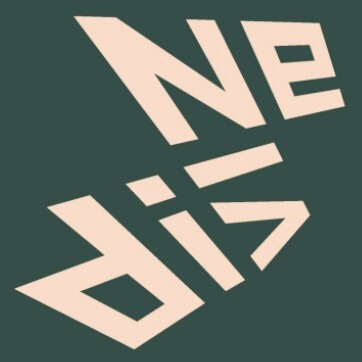
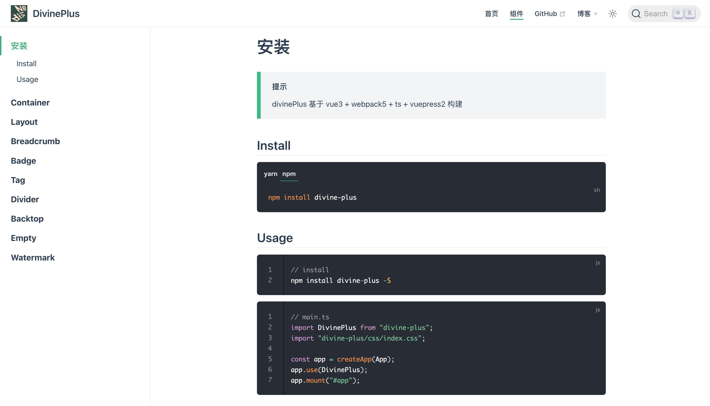

# Divine-Plus

基于 vue3 + webpack5 + ts + vuepress2 构建的组件库



## Homepage

[官网链接 - 说明文档](http://120.53.220.141:8090/)

## Usage

```js
// install

npm install divine-plus -S
```

```js
// main.ts

import DivinePlus from "divine-plus";
import "divine-plus/css/index.css";

const app = createApp(App);
app.use(DivinePlus);
app.mount("#app");
```

> 注意: 不要使用 cnpm 安装，vuepress 依赖 vite 很容易出错



## Discussions

[GitHub Discussions - 讨论区链接](https://github.com/woow-wu7/8-divine-plus/discussions)

## Blog

[[封装 01-设计模式] 设计原则 和 工厂模式(简单抽象方法) 适配器模式 装饰器模式](https://juejin.cn/post/6950958974854234119)  
[[封装 02-设计模式] 命令模式 享元模式 组合模式 代理模式](https://juejin.cn/post/6950958974854234119)  
[[封装 03-设计模式] Decorator 装饰器模式在前端的应用](https://juejin.cn/post/7037871731070992421)  
[[封装 04-设计模式] Publish Subscribe 发布订阅模式在前端的应用](https://juejin.cn/post/7038522552313970696)  
[[封装 05-ElementUI 源码 01] Row Col Container Header Aside MainFooter](https://juejin.cn/post/7042871115848351774)  
[[封装 06-Divine-plus] 从 0 开始封装一个 VUE3-UI 组件库](https://juejin.cn/post/7131232733841817631/)

## Source Code Analysis

#### (1) 8-divine

- [8-divine 源码仓库-vue2 组件库](https://github.com/woow-wu7/8-divine)

#### (2) element-ui 源码分析 [element-ui^2]

- [element-ui 源码分析-仓库](https://github.com/woow-wu7/8-element-source-code-analysis)

#### (3) element-plus 源码分析 [element-plus^2.26]

- [element-plus 源码分析-仓库](https://github.com/woow-wu7/8-element-plus-source-code-analysis)

#### (4) vant [vant^3.4.5]

- [vant3 源码分析-仓库](https://github.com/woow-wu7/8-vant-source-code-analysis)
